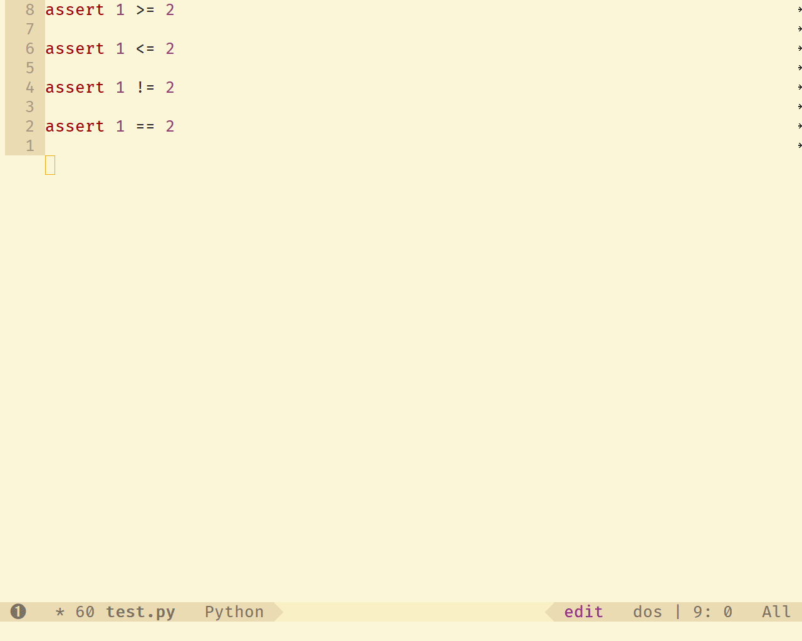

# Fira Code Symbol Mode

If you are a [Fira Code](https://github.com/tonsky/FiraCode) fan, you probably want to use it's beautiful Fira Code Symbols in coding as well. This can be done with Fira Code Symbol minor mode.  

Fira Code Symbols can help your code more readable.

##Prerequisite

install [Fira Code Symbol font](https://github.com/tonsky/FiraCode/files/412440/FiraCode-Regular-Symbol.zip) made by [@siegebell](https://github.com/siegebell)  

---

## Install

~~~scheme
(require 'fira-code-symbol)
~~~

put `fira-code-symbol.el` into  your load-path & add above line intro you init.el

---

## Enable Fira Code Symbol in current buffer

~~~scheme
M-x fira-code-symbol-mode
~~~
enable / disable Fira Code Symbol minor mode in current buffer

---

## Enable Fira Code Symbol by add-hook

~~~scheme
(add-hook 'python-mode-hook 'fira-code-symbol-hook)
~~~

the above code will enable  Fira Code Symbol minor mode in python major mode automatically

---

## Enable Fira Code Symbol in current Major Mode

~~~scheme
M-x enable-fira-code-symbol-in-major-mode
~~~
enable Fira Code Symbol minor mode in all buffers opened in current major mode & add hook to current major mode 

---

## Disable Fira Code Symbol in current Major Mode

~~~
M-x disable-fira-code-symbol-in-major-mode
~~~
disable Fira Code Symbol minor mode in all buffers opened in current major mode & remove hook to current major mode

## Global Fira Code Symbol (not recommended)

~~~emacs
(add-hook 'prog-mode-hook 'fira-code-symbol-hook)
~~~

enable Fira Code Symbol minor mode globally, It's probably not a good idea to have  Fira Code Symbol in a major mode like org-mode.

